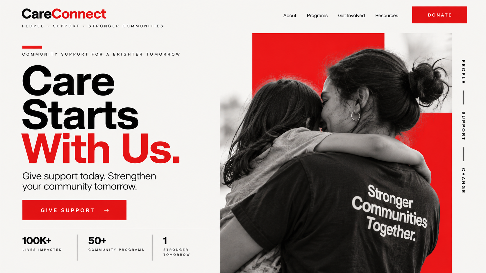
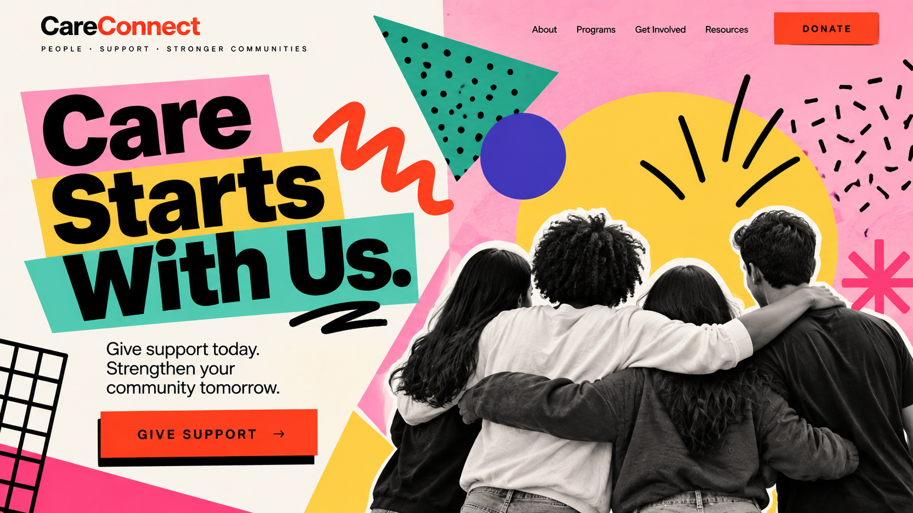

# Caregiver

## 1. Definition

The Caregiver archetype represents compassion, protection, and helping others. Caregiver brands focus on supporting people's well-being and making them feel cared for.

## 2. Characteristics

- Shows compassion and generosity.
- Protects and supports others.
- Values service and responsibility.
- Focuses on comfort and well-being.

## 3. Imagery

Images of caregivers helping people, families supporting one another, or hands offering help can represent the Caregiver. These visuals communicate compassion, safety, and support.

## 4. Color Scheme

Blue: Suggests trust and dependability.

Green: Can connect with health and well-being.

Soft pink: Can suggest warmth and compassion.

These are suggested design choices, not fixed colors for the archetype.

## 5. Examples

Johnson & Johnson is often associated with the Caregiver because its products and communications are connected with health and care for families.

## Design Examples

### Example 1 — Modernist

**Archetype:** Caregiver  
**Design Style:** Swiss Style  
**Persuasion Principle:** Reciprocity  

The Swiss Style uses a clean grid, bold typography, and a simple layout to make the Caregiver message feel clear and trustworthy. The Caregiver archetype is shown through the focus on community support, while reciprocity is used through the call to give support and help others. The design keeps the message simple so the viewer can quickly understand the purpose and take action.

**Style Reference:** [Swiss Style](../design-styles/Swiss-Style.md)

*Image generated with AI.*
### Example 2 — Postmodernist

**Archetype:** Caregiver  
**Design Style:** Memphis Design  
**Persuasion Principle:** Reciprocity  

The Memphis Design style uses bright colors, bold shapes, and a playful layout to make the Caregiver message more energetic and noticeable. The Caregiver archetype is represented through people supporting one another, while reciprocity encourages viewers to give support to their community. The playful design presents the same CareConnect message in a very different way from the Swiss Style version.

**Style Reference:** [Memphis Design](../design-styles/Memphis-Design.md)

*Image generated with AI.*

## 6. References

Mark, Margaret, and Carol S. Pearson. *The Hero and the Outlaw: Building Extraordinary Brands Through the Power of Archetypes*. McGraw-Hill, 2001. ISBN 978-0-07-136415-7. This book presents the brand archetype framework. The Johnson & Johnson association is an illustrative interpretation.
