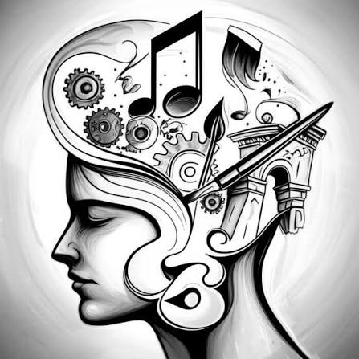

# Creator

## 1. Definition

The Creator archetype represents imagination and the desire to make something original. Creator brands help people express ideas and bring them into the world.

## 2. Characteristics

- Values originality and self-expression.
- Uses imagination and creative thinking.
- Encourages making or designing things.
- Cares about craft and personal vision.

## 3. Imagery

Art supplies, sketches, building blocks, workshops, or people making things can represent the Creator. These visuals show ideas developing into something tangible.

## 4. Color Scheme

Yellow: Can suggest imagination and creative energy.

Blue: Can feel open and inspire new ideas.

White: Gives space for the work or creation to stand out.

These are suggested design choices, not fixed colors for the archetype.

## 5. Examples

LEGO is often associated with the Creator because its building sets let people design and build their own creations.

## 6. References

Mark, Margaret, and Carol S. Pearson. *The Hero and the Outlaw: Building Extraordinary Brands Through the Power of Archetypes*. McGraw-Hill, 2001. ISBN 978-0-07-136415-7. This book presents the brand archetype framework. The LEGO association is an illustrative interpretation.
