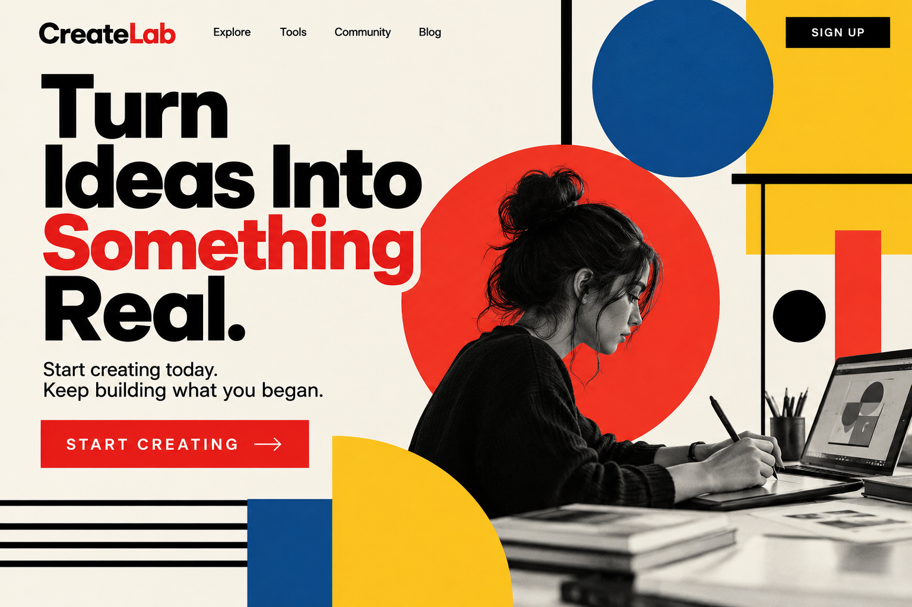
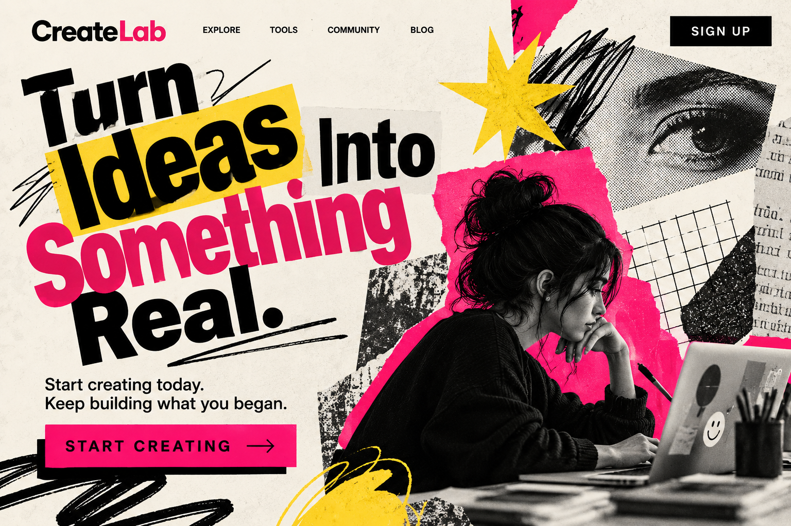

# Creator

## 1. Definition

The Creator archetype represents imagination and the desire to make something original. Creator brands help people express ideas and bring them into the world.

## 2. Characteristics

- Values originality and self-expression.
- Uses imagination and creative thinking.
- Encourages making or designing things.
- Cares about craft and personal vision.

## 3. Imagery

Art supplies, sketches, building blocks, workshops, or people making things can represent the Creator. These visuals show ideas developing into something tangible.

## 4. Color Scheme

Yellow: Can suggest imagination and creative energy.

Blue: Can feel open and inspire new ideas.

White: Gives space for the work or creation to stand out.

These are suggested design choices, not fixed colors for the archetype.

## 5. Examples

LEGO is often associated with the Creator because its building sets let people design and build their own creations.

## 6. Design Examples

### Example 1 — Modernist

**Archetype:** Creator  
**Design Style:** Bauhaus  
**Persuasion Principle:** Commitment & Consistency  

The Bauhaus style uses simple geometric shapes, bold typography, and primary colors to represent creativity in a clear and organized way. The Creator archetype is shown through the focus on turning ideas into real designs, while commitment and consistency encourages the viewer to start creating and continue building on their work.

**Style Reference:** [Bauhaus](../design-styles/Bauhaus.md)

*Image generated with AI.*

### Example 2 — Postmodernist

**Archetype:** Creator  
**Design Style:** New Wave Typography  
**Persuasion Principle:** Commitment & Consistency  

The New Wave Typography style uses experimental text placement, layered elements, and an irregular layout to create a more expressive design. The Creator archetype is represented through experimentation and making new ideas, while commitment and consistency encourages the viewer to begin creating and continue developing their work.

**Style Reference:** [New Wave Typography](../design-styles/New-Wave-Typography.md)

*Image generated with AI.*

## 7. References

Mark, Margaret, and Carol S. Pearson. *The Hero and the Outlaw: Building Extraordinary Brands Through the Power of Archetypes*. McGraw-Hill, 2001. ISBN 978-0-07-136415-7. This book presents the brand archetype framework. The LEGO association is an illustrative interpretation.
