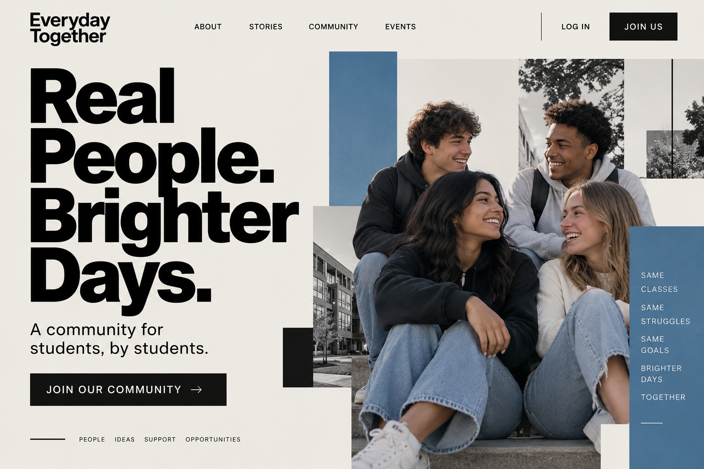
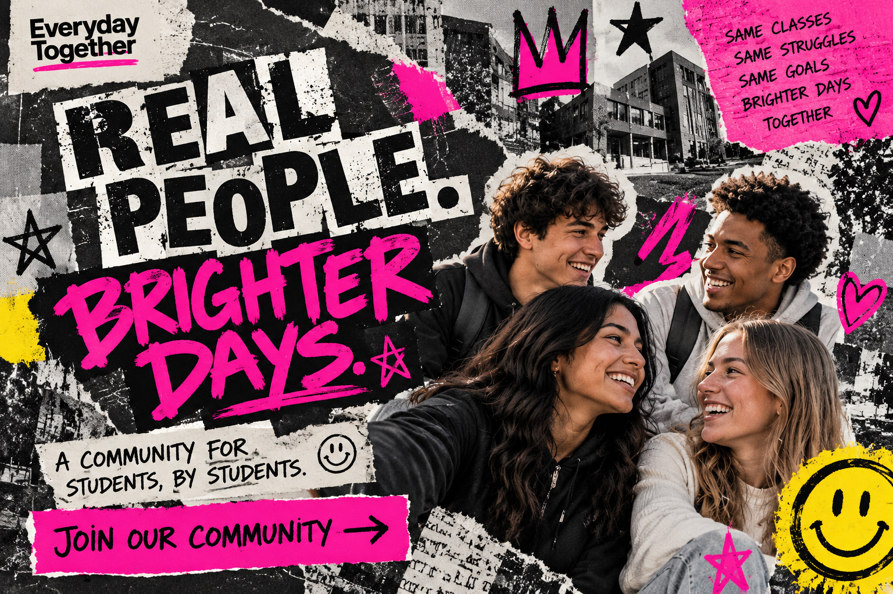

# Everyperson

## 1. Definition

The Everyperson archetype represents belonging, equality, and being part of an everyday community. Everyperson brands aim to feel friendly, practical, and relatable.

## 2. Characteristics

- Values belonging and connection.
- Comes across as approachable and down-to-earth.
- Treats people as equals.
- Focuses on useful, everyday needs.

## 3. Imagery

Friends, families, neighbors, or people sharing an everyday activity can represent the Everyperson. These scenes show inclusion and familiar experiences.

## 4. Color Scheme

Blue: Can suggest reliability and approachability.

Green: Can feel natural and welcoming.

Orange: Can add a friendly, energetic quality.

These are suggested design choices, not fixed colors for the archetype.

## 5. Examples

IKEA is often associated with the Everyperson because it offers practical home furnishings for everyday households.

## 6. Design Examples

### Example 1 — Modernist

**Archetype:** Everyperson  
**Design Style:** International Typographic Style  
**Persuasion Principle:** Liking  

The Swiss Style uses a clean grid, simple typography, and an organized layout to make the message easy to understand. The Everyperson archetype is represented through ordinary students and a sense of belonging, while liking works by making the audience feel connected to relatable people and experiences.

**Style Reference:** [Swiss Style](../design-styles/Swiss-Style.md)

*Image generated with AI.*

### Example 2 — Postmodernist

**Archetype:** Everyperson  
**Design Style:** Punk Design  
**Persuasion Principle:** Liking  

The Punk Design style uses rough textures, bold lettering, collage elements, and an irregular layout to create an expressive and rebellious look. The Everyperson archetype is represented through relatable students and a shared sense of community, while liking connects with the audience through people and experiences that feel familiar.

**Style Reference:** [Punk Design](../design-styles/Punk-Design.md)

*Image generated with AI.*

## 7. References

Mark, Margaret, and Carol S. Pearson. *The Hero and the Outlaw: Building Extraordinary Brands Through the Power of Archetypes*. McGraw-Hill, 2001. ISBN 978-0-07-136415-7. This book presents the brand archetype framework. The IKEA association is an illustrative interpretation.
