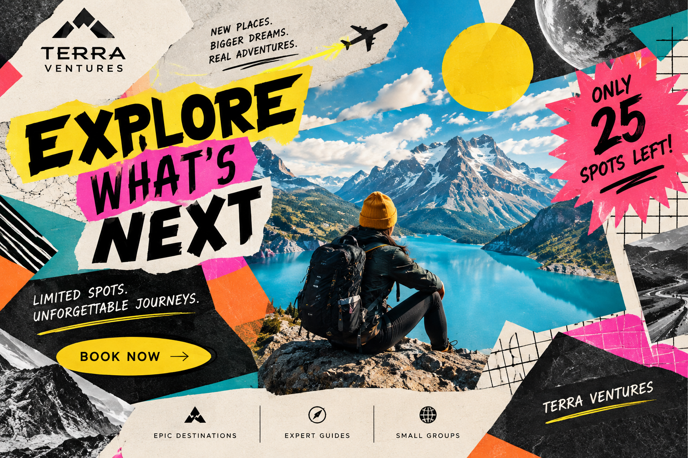

# Explorer

## 1. Definition

The Explorer archetype represents independence, discovery, and the desire to experience the world. Explorer brands encourage people to find their own path and seek new places or ideas.

## 2. Characteristics

- Values freedom and independence.
- Enjoys discovery and adventure.
- Seeks new experiences.
- Encourages people to follow their own path.

## 3. Imagery

Images of trails, maps, mountains, or open landscapes can represent the Explorer. They suggest movement, freedom, and the possibility of discovering somewhere new.

## 4. Color Scheme

Green: Connects with nature and outdoor exploration.

Blue: Can suggest open skies, water, and freedom.

Earthy gray: Can evoke rocks, trails, and rugged landscapes.

These are suggested design choices, not fixed colors for the archetype.

## 5. Examples

Jeep is often associated with the Explorer because its vehicles are marketed for travel and outdoor adventure.

## Design Style
### Example 1 — Modernist

 
*Image generated with AI.*

**Archetype:** Explorer  
**Design Style:** Futurism  
**Persuasion Principle:** Scarcity  

The Deconstructionism style uses an unconventional layout, overlapping elements, and broken grids to create a sense of discovery and experimentation. The Explorer archetype is shown through the focus on exploring unfamiliar ideas and breaking away from what is expected, while scarcity is used by presenting the experience as something rare or exclusive. The unusual design encourages the viewer to look closer and discover the message for themselves.

**Style Reference:** [Deconstructionism](../design-styles/Deconstructionism.md)

### Example 2 — Postmodernist

  
*Image generated with AI.*

**Archetype:** Explorer  
**Design Style:** Deconstructionism   
**Persuasion Principle:** Scarcity  

The Postmodernism style uses bold colors, unusual layouts, mixed typography, and unexpected visual elements to create a sense of exploration and individuality. The Explorer archetype is shown through the focus on discovering new experiences and looking beyond the familiar, while scarcity is used by presenting the experience as something rare or exclusive. The unconventional design encourages the viewer to look closer and discover something that feels unique.

**Style Reference:** [Postmodernism](../design-styles/Postmodernism.md)

## 6. References

Mark, Margaret, and Carol S. Pearson. *The Hero and the Outlaw: Building Extraordinary Brands Through the Power of Archetypes*. McGraw-Hill, 2001. ISBN 978-0-07-136415-7. This book presents the brand archetype framework. The Jeep association is an illustrative interpretation.
