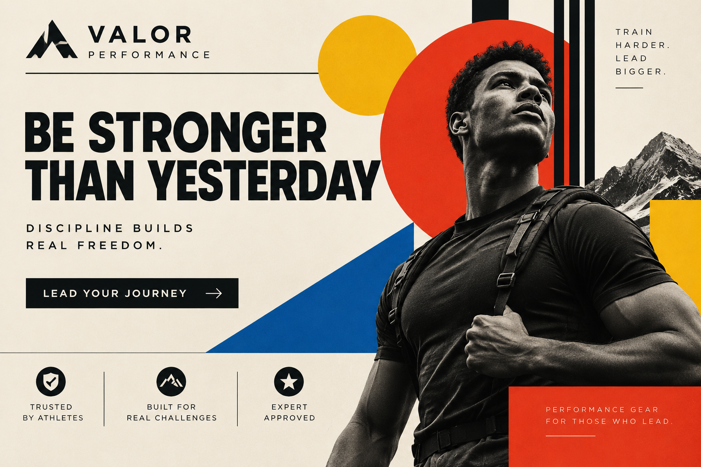
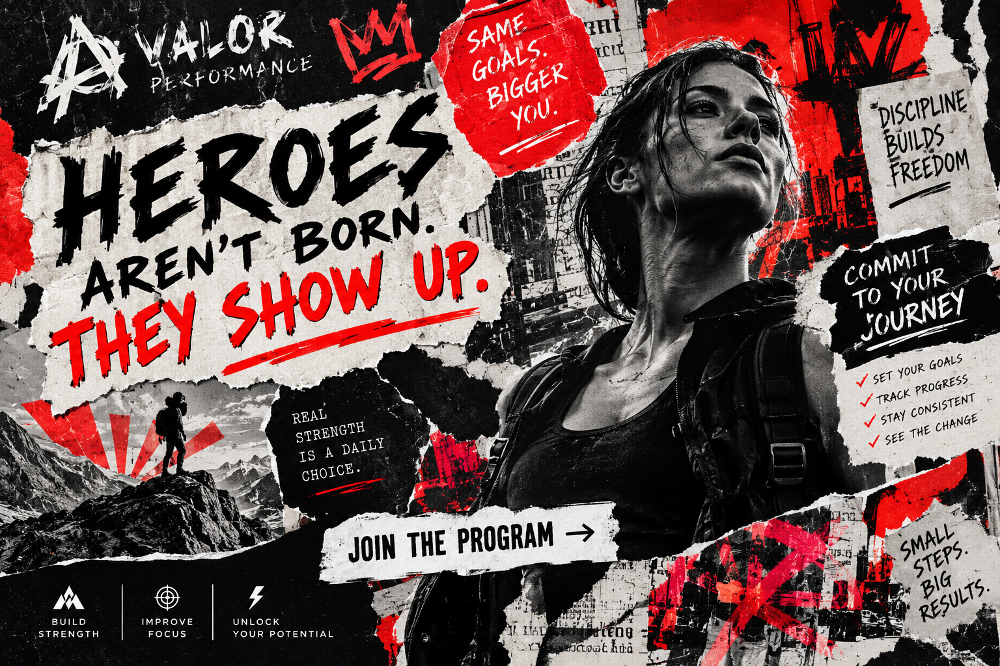

# Hero

## 1. Definition

The Hero archetype represents courage, determination, and the desire to overcome challenges. Hero brands encourage people to work hard and achieve something meaningful.

## 2. Characteristics

- Shows courage and confidence.
- Faces challenges directly.
- Values discipline, effort, and achievement.
- Inspires people to improve or succeed.

## 3. Imagery

Images of athletes, rescuers, or people overcoming difficult challenges can represent the Hero. These visuals show action, effort, and success after a struggle.

## 4. Color Scheme

Red: Suggests energy, courage, and action.

Black: Can communicate strength and determination.

Gold: Can suggest achievement and success.

These are suggested design choices, not fixed colors for the archetype.

## 5. Examples

Nike is often associated with the Hero because its athletic branding focuses on effort, performance, and achieving goals.

## Design Examples

### Example 1 — Modernist

 
*Image generated with AI.*

**Archetype:** Hero  
**Design Style:** Bauhaus  
**Persuasion Principle:** Authority  

The Bauhaus style uses clean geometric shapes, structured layouts, bold typography, and a focus on function to create a strong and confident visual message. The Hero archetype is shown through the focus on strength, leadership, and overcoming challenges, while authority is used by presenting the Hero as a capable and trustworthy figure. The organized design makes the message feel powerful, direct, and reliable.

**Style Reference:** [Bauhaus](../design-styles/Bauhaus.md)

### Example 2 — Postmodernist

  
*Image generated with AI.*

**Archetype:** Hero  
**Design Style:** Punk Design  
**Persuasion Principle:** Commitment & Consistency  

The Punk Design style uses bold typography, high-contrast imagery, rough textures, and unconventional layouts to create an energetic and rebellious visual message. The Hero archetype is shown through the focus on courage, strength, and standing up against challenges, while commitment and consistency are used to show the Hero remaining dedicated to their beliefs and goals. The bold design emphasizes determination and encourages the viewer to take a strong stand.

**Style Reference:** [Punk Design](../design-styles/Punk-Design.md)

## 6. References

Mark, Margaret, and Carol S. Pearson. *The Hero and the Outlaw: Building Extraordinary Brands Through the Power of Archetypes*. McGraw-Hill, 2001. ISBN 978-0-07-136415-7. This book presents the brand archetype framework. The Nike association is an illustrative interpretation.
