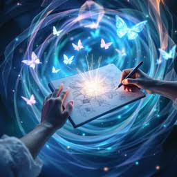

# Magician

## 1. Definition

The Magician archetype represents transformation and the ability to make a vision or possibility feel real. Magician brands promise an experience that can change how people see or do something.

## 2. Characteristics

- Creates a sense of wonder.
- Focuses on transformation and possibility.
- Uses imagination and innovation.
- Makes experiences feel memorable or surprising.

## 3. Imagery

Images of illusions, stars, light, or a dramatic before-and-after can represent the Magician. They suggest wonder and change, which are central to this archetype.

## 4. Color Scheme

Deep blue: Can suggest mystery and imagination.

Purple: Often suggests magic and wonder.

Silver: Can give a visual a dreamlike or futuristic feeling.

These are suggested design choices, not fixed colors for the archetype.

## 5. Examples

Disney is often associated with the Magician because its stories and entertainment create imaginative worlds and memorable experiences.

## 6. References

Mark, Margaret, and Carol S. Pearson. *The Hero and the Outlaw: Building Extraordinary Brands Through the Power of Archetypes*. McGraw-Hill, 2001. ISBN 978-0-07-136415-7. This book presents the brand archetype framework. The Disney association is an illustrative interpretation.
