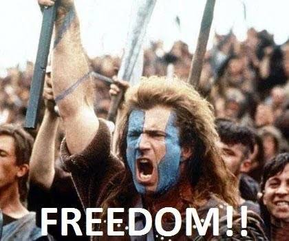

# Outlaw

## 1. Definition

The Outlaw archetype represents rebellion against rules or traditions that feel limiting. Outlaw brands stand for independence, change, and doing things differently.

## 2. Characteristics

- Challenges the usual way of doing things.
- Values independence and self-expression.
- Can feel bold, disruptive, or rebellious.
- Appeals to people who want change.

## 3. Imagery

Images of open roads, worn textures, bold symbols, or people breaking away from a crowd can represent the Outlaw. These visuals communicate nonconformity and independence.

## 4. Color Scheme

Black: Can suggest defiance and strength.

Red: Adds energy and boldness.

Dark gray: Can create a tough, unconventional look.

These are suggested design choices, not fixed colors for the archetype.

## 5. Examples

Harley-Davidson is often associated with the Outlaw because its brand image emphasizes independence, individuality, and life on the open road.

## 6. References

Mark, Margaret, and Carol S. Pearson. *The Hero and the Outlaw: Building Extraordinary Brands Through the Power of Archetypes*. McGraw-Hill, 2001. ISBN 978-0-07-136415-7. This book presents the brand archetype framework. The Harley-Davidson association is an illustrative interpretation.
