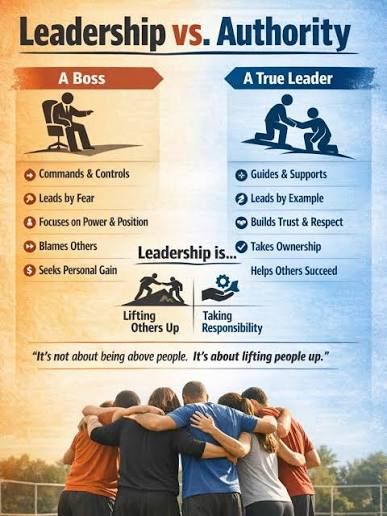

# Ruler

## 1. Definition

The Ruler archetype represents leadership, responsibility, and a desire for order and stability. Ruler brands communicate confidence, quality, and control.

## 2. Characteristics

- Values leadership and responsibility.
- Creates a sense of order and stability.
- Communicates confidence and authority.
- Often emphasizes quality and high standards.

## 3. Imagery

Formal settings, carefully arranged spaces, crowns, or symbols of leadership can represent the Ruler. These visuals suggest order, status, and control.

## 4. Color Scheme

Navy blue: Can suggest authority and reliability.

Black: Can communicate control and sophistication.

Gold: Can suggest status and high quality.

These are suggested design choices, not fixed colors for the archetype.

## 5. Examples

Rolex is often associated with the Ruler because its luxury watches communicate status, precision, and high standards.

## 6. References

Mark, Margaret, and Carol S. Pearson. *The Hero and the Outlaw: Building Extraordinary Brands Through the Power of Archetypes*. McGraw-Hill, 2001. ISBN 978-0-07-136415-7. This book presents the brand archetype framework. The Rolex association is an illustrative interpretation.
