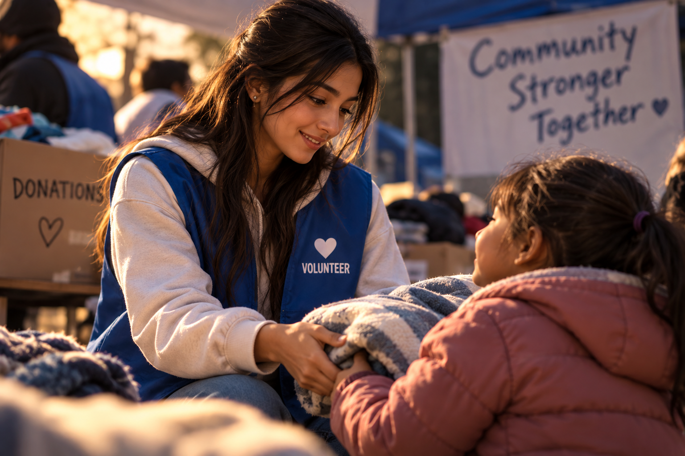

## Caregiver

### Matching Method of Persuasion
**Reciprocity**

### Why They Match
The Caregiver archetype focuses on helping, protecting, and caring for others. Reciprocity matches this archetype because when a person or brand provides help, support, or kindness, people may feel motivated to give something back in return.

### Real-World Example
A charity that provides food, clothing, or other support can use reciprocity by showing people the help it gives to communities, which may encourage people to donate or support the organization.

### Image Description

The image shows a volunteer giving a blanket to a child at a community donation event. It represents compassion, generosity, support, and helping others.
