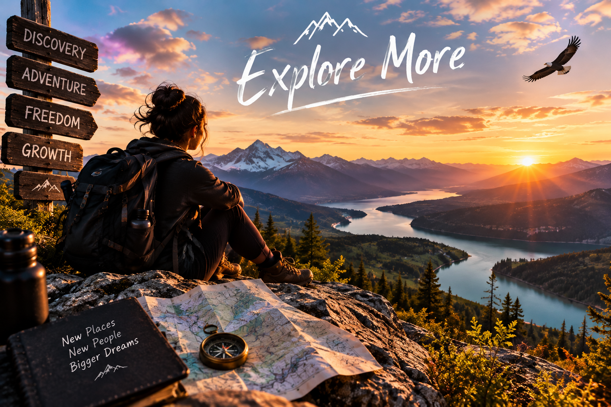

# Explorer

## Matching Methods of Persuasion

- **Scarcity**
- **Liking**

## Why They Match

The Explorer archetype focuses on **freedom, adventure, independence, discovery, and experiencing something new**.

**Scarcity** is a strong match because Explorer brands can make experiences feel rare, exclusive, or limited. When people believe they may miss out on a unique adventure or opportunity, they may be more motivated to take action.

**Liking** also works because Explorer brands often create an exciting and adventurous personality that people want to connect with. Customers may be attracted to brands that represent the freedom, curiosity, and adventurous lifestyle they want for themselves.

## Real-World Examples

- **Jeep** – Promotes adventure, freedom, and exploring places beyond the ordinary.
- **National Geographic** – Connects exploration with discovering new places, cultures, and experiences.

## Example of Persuasion

A travel company could advertise a **limited number of spots** for an exclusive hiking trip to a remote destination.

This uses **Scarcity** because the limited number of spots creates a sense of urgency and makes the experience feel exclusive. It also uses **Liking** by presenting the trip as an exciting adventure for people who enjoy freedom, exploration, and discovering new places.

## Image Description

The image represents the **Explorer archetype** through a traveler sitting on a mountain overlooking a large landscape. The image includes a **backpack, map, compass, mountains, sunrise, and adventure signs** labeled with ideas such as **Discovery, Adventure, Freedom, and Growth**.

The image represents the Explorer's desire to **discover new places, experience adventure, seek freedom, and explore the unknown**.

## Image

**Image generated with AI.**
