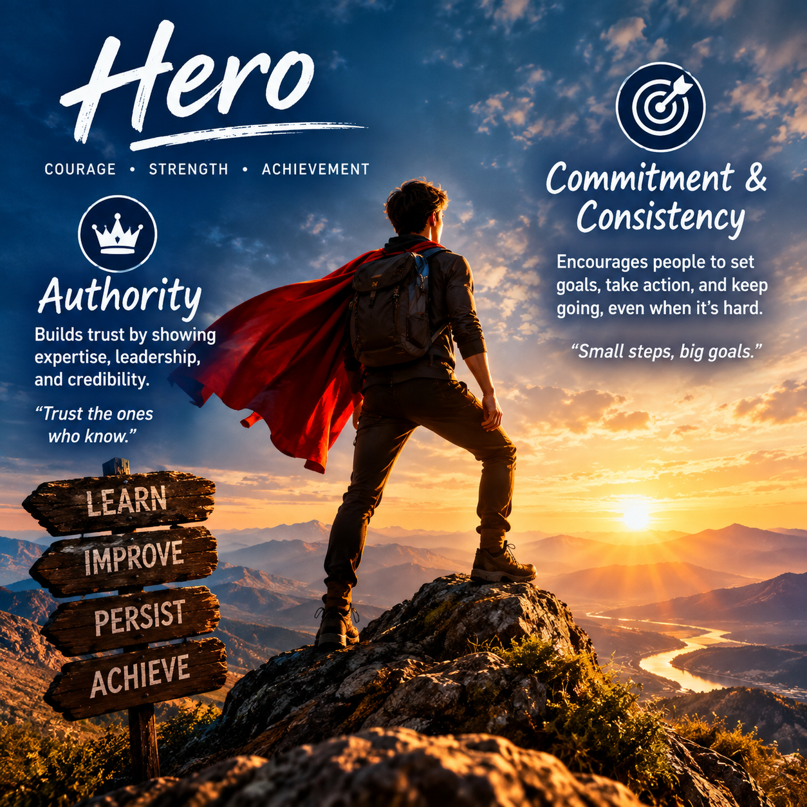

# Hero

## Matching Methods of Persuasion

- **Authority**
- **Commitment and Consistency**

## Why They Match

The Hero archetype focuses on **courage, achievement, strength, determination, and overcoming challenges**.

**Authority** is a strong match because Hero brands often present themselves as strong, capable, and knowledgeable. People may trust a brand when it demonstrates expertise, leadership, and the ability to help them succeed.

**Commitment and Consistency** also works because Hero brands encourage people to set goals, take action, and stay committed to overcoming challenges. Once people commit to a goal, they may be more likely to continue taking actions that match that commitment.

## Real-World Examples

- **Nike** – Encourages people to challenge themselves, overcome obstacles, and achieve their goals.
- **Under Armour** – Uses themes of determination, strength, performance, and overcoming challenges.

## Example of Persuasion

A fitness company could encourage customers to sign up for a **30-day challenge** designed to help them reach a personal fitness goal.

This uses **Commitment and Consistency** because customers make a commitment to complete the challenge and continue working toward their goal. It also uses **Authority** by having professional trainers provide guidance and demonstrate their expertise.

## Image Description

The image represents the **Hero archetype** through a heroic figure standing on top of a mountain with a flowing cape and glowing shield. The sunrise represents **hope, strength, achievement, and victory**.

The image represents the Hero's desire to **overcome challenges, become stronger, achieve goals, and inspire others**.

## Image

**Image generated with AI.**
