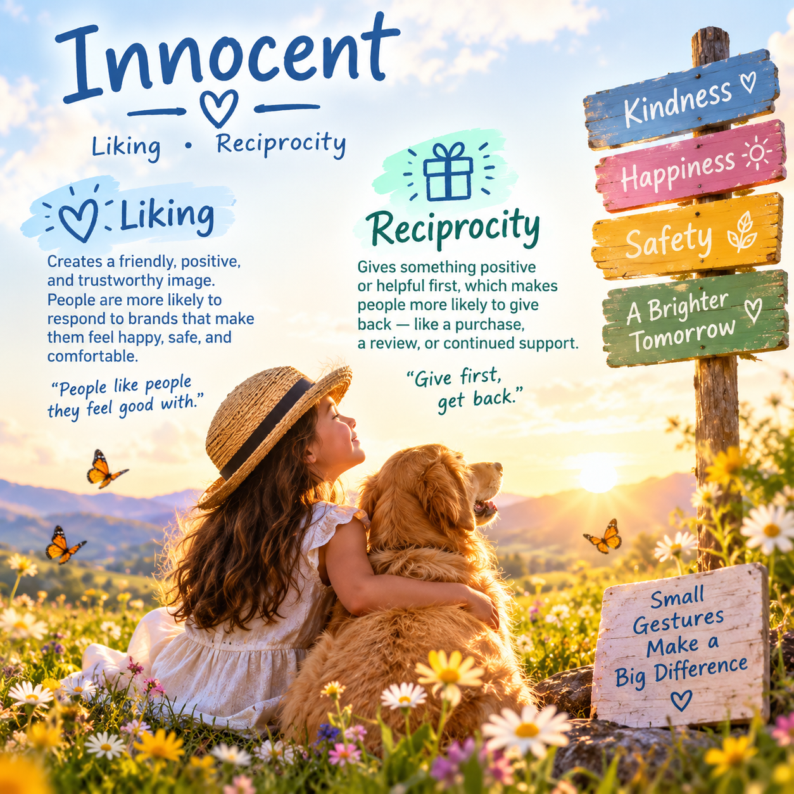

# Innocent

## Matching Methods of Persuasion

- **Liking**
- **Reciprocity**

## Why They Match

The Innocent archetype focuses on **optimism, simplicity, happiness, kindness, safety, and seeing the good in the world**.

**Liking** is a strong match because Innocent brands often create a friendly, positive, and comforting personality. People are more likely to respond positively to brands that make them feel happy, safe, and comfortable.

**Reciprocity** also works because Innocent brands can give customers something positive or helpful before asking for something in return. This could include free resources, helpful information, samples, or positive experiences.

## Real-World Examples

- **Dove** – Uses messages of positivity, confidence, and self-acceptance.
- **Coca-Cola** – Often connects its branding with happiness, friendship, sharing, and positive experiences.

## Example of Persuasion

A company could give customers a **free sample or small gift** before asking them to purchase a product.

This uses **Reciprocity** because the company gives the customer something first, which may encourage the customer to return the favor. It also uses **Liking** by creating a friendly and positive experience that makes customers feel connected to the brand.

## Image Description

The image represents the **Innocent archetype** through a child standing in a peaceful flower field beside a golden dog at sunrise. Butterflies, soft clouds, flowers, and warm sunlight symbolize **peace, innocence, happiness, and hope**.

The image represents the Innocent's desire for **peace, safety, simplicity, happiness, and a positive view of the world**.

## Image

**Image generated with AI.**
