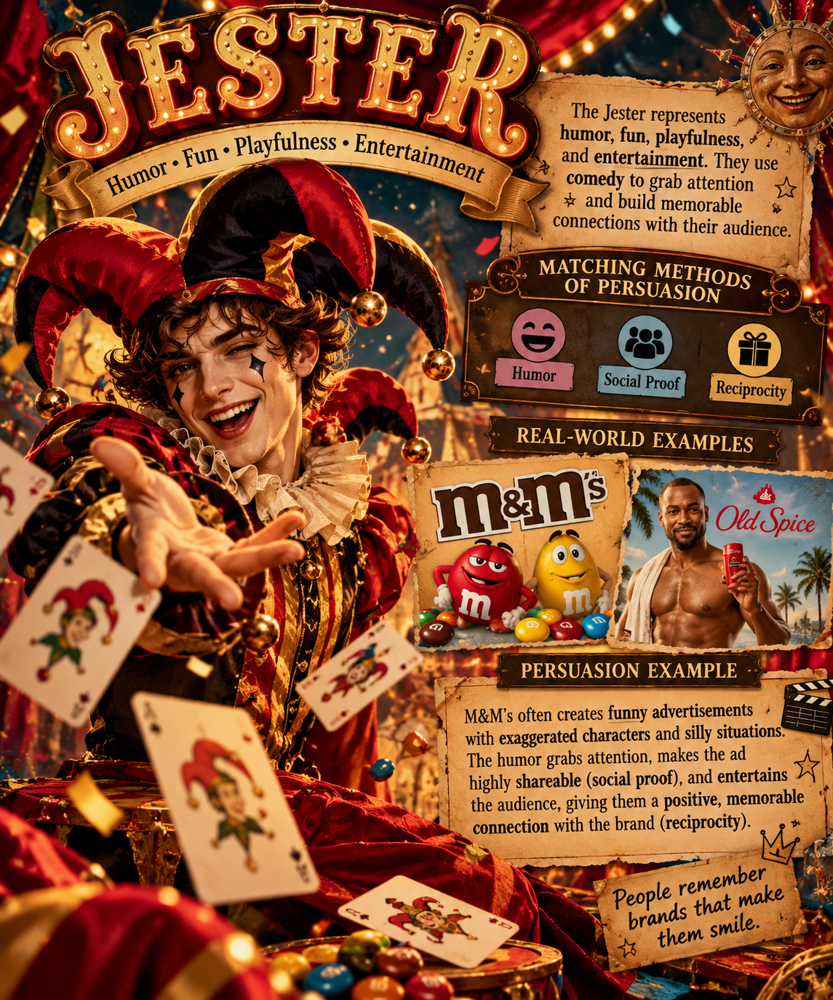

## Jester

### Matching Methods of Persuasion

- **Humor**
- **Social Proof**
- **Reciprocity**

### Why They Match

The Jester archetype focuses on humor, fun, playfulness, and entertainment. Humor works because Jester brands try to make their audience laugh and create memorable experiences. Social proof can help when funny content is shared and talked about by other people. Reciprocity also works because entertaining the audience gives them something enjoyable, which can make them more likely to interact with or support the brand.

### Real-World Examples

- **M&M's** – Uses funny characters and playful advertisements to entertain customers.
- **Old Spice** – Uses exaggerated and unexpected humor to make its advertisements memorable.

### Example of Persuasion

A candy company could create a funny advertisement using exaggerated characters and silly situations. The humor grabs attention and entertains the audience, while people sharing and talking about the advertisement creates social proof.

### Image Description

The image represents the Jester archetype through humor, fun, playfulness, and entertainment. It shows how humor and memorable visuals can help a brand connect with its audience.
