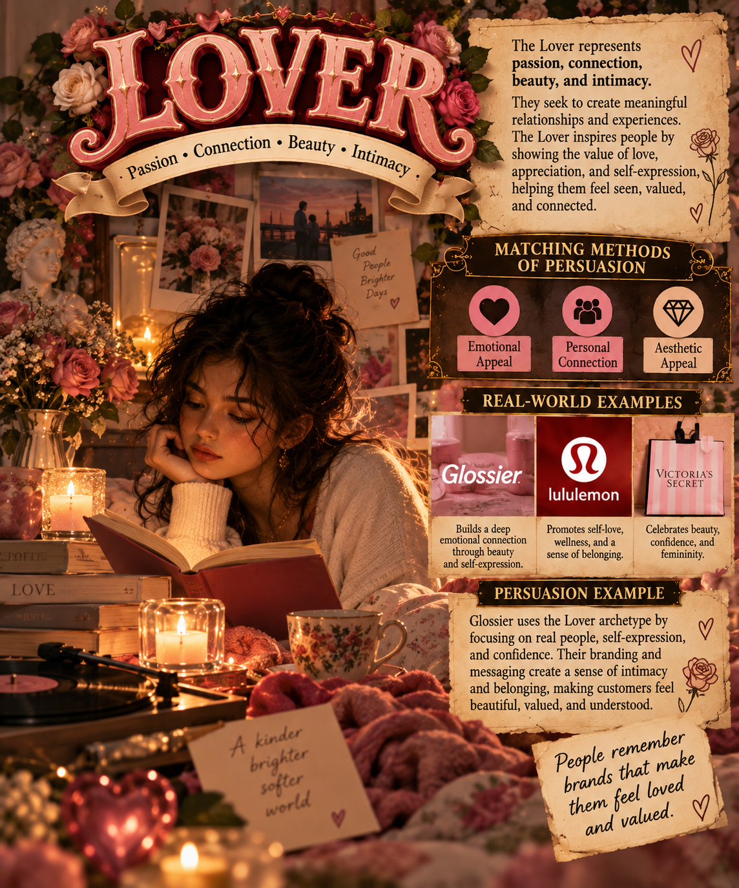

## Lover

### Matching Methods of Persuasion

- **Emotional Appeal**
- **Relationship Building**
- **Sensory Experience**

### Why They Match

The Lover archetype focuses on connection, intimacy, beauty, and making people feel valued. Emotional appeal works because Lover brands connect with people's feelings and personal experiences. Relationship building helps create a stronger connection between the brand and its customers. Sensory experiences can also make products feel more personal and memorable.

### Real-World Examples

- **Glossier** – Focuses on beauty, confidence, and creating a personal connection with customers.
- **Victoria's Secret** – Uses beauty, emotion, and confidence to create a strong connection with its audience.

### Example of Persuasion

A beauty company could create an advertisement focused on self-care and feeling confident. The advertisement could use warm visuals and an emotional message to make customers feel understood and valued.

### Image Description

The image represents the Lover archetype through intimacy, connection, beauty, and emotion. It shows how Lover brands can create meaningful relationships with customers by making them feel valued and understood.
