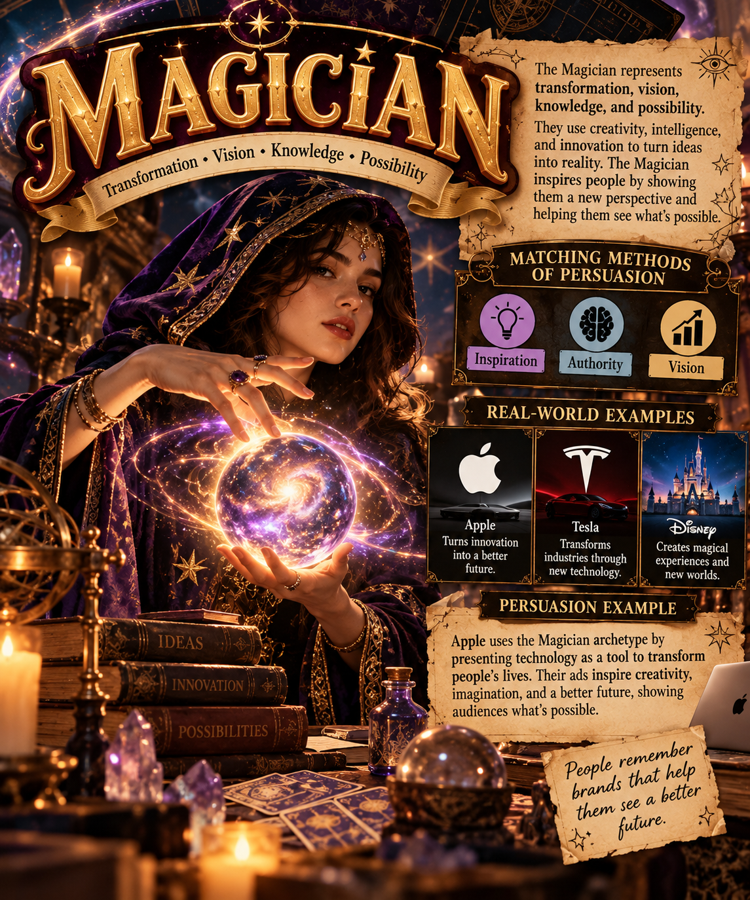

## Magician

### Matching Methods of Persuasion

- **Inspiration**
- **Authority**
- **Vision**

### Why They Match

The Magician archetype focuses on transformation, possibility, knowledge, and creating change. Inspiration works because Magician brands encourage people to imagine what is possible. Authority helps the brand appear knowledgeable and capable of creating results. Vision works by showing customers how a product or service can transform their experience or future.

### Real-World Examples

- **Apple** – Uses innovation and technology to show how its products can change the way people work, communicate, and create.
- **Disney** – Creates imaginative experiences that make fantasy and possibility feel real.

### Example of Persuasion

A technology company could advertise a new product by showing how it transforms an everyday task into something easier and more creative. This uses inspiration and vision by showing customers what could be possible with the product.

### Image Description

The image represents the Magician archetype through transformation, imagination, knowledge, and possibility. It shows how Magician brands inspire people by presenting a vision of change and a better future.
