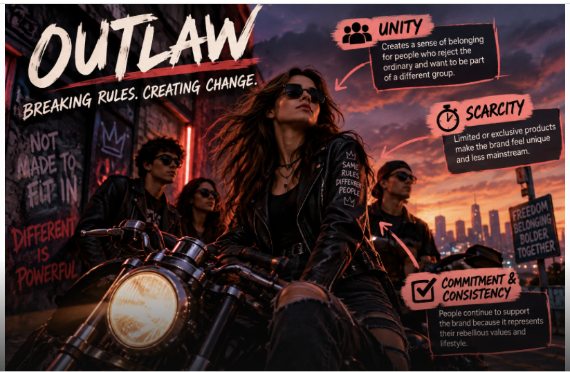

## Outlaw

### Matching Methods of Persuasion
- **Unity**
- **Scarcity**
- **Commitment & Consistency**

### Why They Match
The Outlaw archetype is about breaking rules, challenging what is normal, and creating change. **Unity** works because Outlaw brands can bring together people who share the same rebellious attitude. **Scarcity** works because exclusive or limited products can make the brand feel different from the mainstream. **Commitment & Consistency** can also work because customers may continue supporting a brand that represents their rebellious values.

### Real-World Examples
- **Harley-Davidson** – Represents freedom, independence, and rebellion.
- **Diesel** – Uses bold and unconventional branding that challenges traditional expectations.

### Example of Persuasion
A clothing brand could use the message:

> "Made for people who were never meant to fit in."

This mainly uses **Unity** because it makes customers feel like they belong to a group of people who are different from everyone else.

