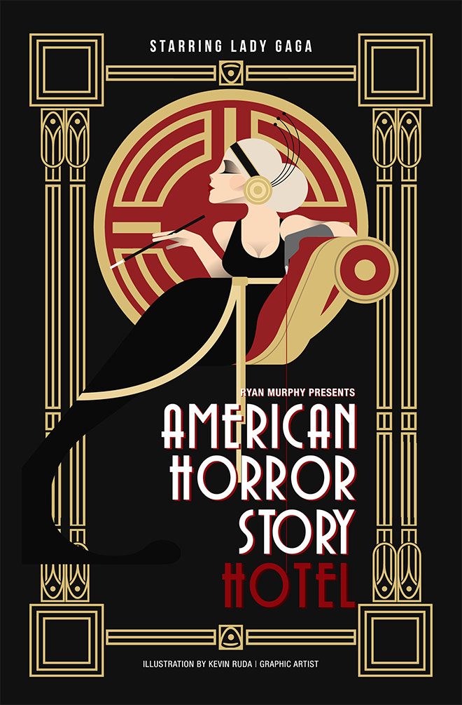

# Art Deco

## 1. Definition

Art Deco is a design movement that became popular during the 1920s and 1930s. It combined modern design with luxury and decoration, creating a bold and glamorous style that appeared in architecture, fashion, posters, furniture, and other forms of design.

## 2. Characteristics

- Geometric and symmetrical shapes
- Bold and decorative patterns
- Clean, sharp lines
- Luxurious appearance
- Sunburst and zigzag patterns
- Influence from modern technology and architecture

## 3. Imagery

Art Deco designs often include geometric patterns, skyscrapers, sunbursts, fans, and symmetrical shapes. The style is commonly associated with the glamorous architecture and advertisements of the 1920s and 1930s.

### Image Description

## 4. Color Scheme

Art Deco commonly uses black, gold, silver, dark green, blue, and other rich colors. Metallic colors such as gold and silver help create the luxurious and glamorous appearance associated with the style.

## 5. Examples

- The Chrysler Building in New York City
- Art Deco travel and advertising posters
- Decorative furniture and interiors from the 1920s and 1930s

## 6. References

