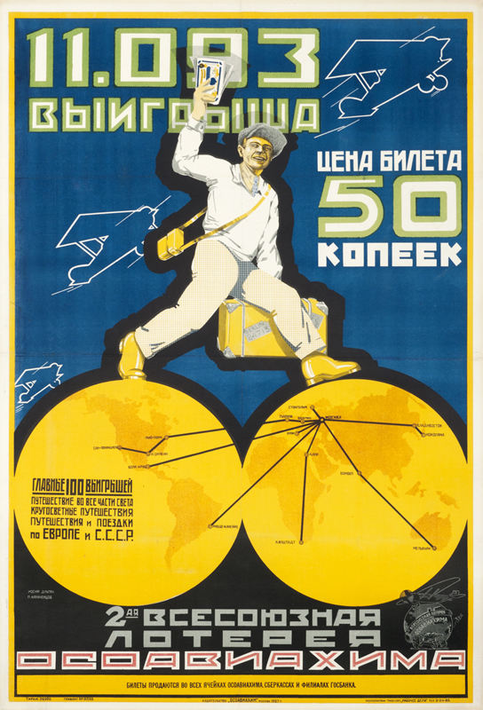

# Constructivism

## 1. Definition

Constructivism was a modernist art and design movement that began in Russia in the early 20th century. It focused on using art for practical and social purposes rather than simply for decoration.

## 2. Characteristics

- Bold geometric shapes
- Strong diagonal lines
- Large and dramatic typography
- Simple and powerful layouts
- Photomontage and photography
- Designs that communicate a clear message

## 3. Imagery

Constructivist designs often use geometric shapes, photographs, bold lettering, and diagonal layouts. Posters were especially important to the movement and were designed to quickly attract attention and communicate ideas.

### Image Description

## 4. Color Scheme

Constructivist designs commonly use red, black, and white. These strong contrasting colors helped posters appear bold, dramatic, and easy to notice.

## 5. Examples

- Alexander Rodchenko's posters and graphic designs
- El Lissitzky's *Beat the Whites with the Red Wedge*
- Russian Constructivist propaganda posters

## 6. References

The Museum of Modern Art. "Aleksandr Rodchenko." MoMA.

Tate. "Constructivism." Tate.
