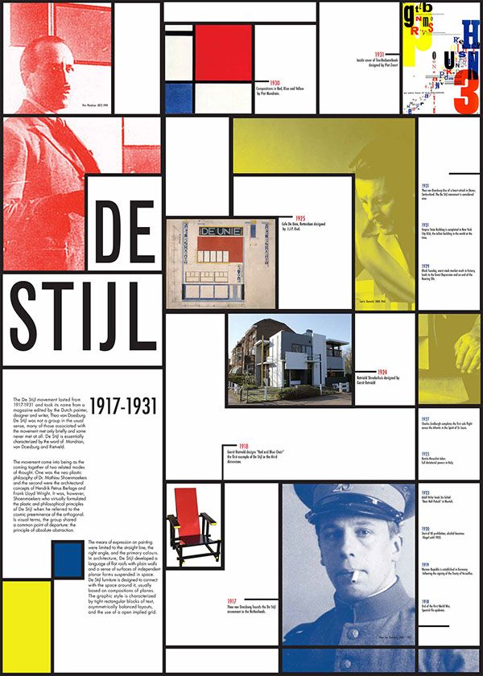

# De Stijl

## 1. Definition

De Stijl was a Dutch modernist art and design movement founded in 1917. The movement focused on creating simple and balanced designs by reducing art to basic geometric shapes, straight lines, and primary colors.

## 2. Characteristics

- Simple geometric shapes
- Horizontal and vertical lines
- Asymmetrical but balanced layouts
- Minimal decoration
- Use of primary colors
- Focus on simplicity and abstraction

## 3. Imagery

De Stijl designs commonly feature squares, rectangles, and straight black lines. The designs are usually divided into sections using bold lines and blocks of color.

### Image Description

## 4. Color Scheme

De Stijl is strongly associated with the primary colors red, blue, and yellow. Black, white, and gray are also commonly used to separate shapes and create contrast.

## 5. Examples

- Piet Mondrian's geometric paintings
- Gerrit Rietveld's Red and Blue Chair
- The Rietveld Schröder House

## 6. References

The Museum of Modern Art. "De Stijl." MoMA.

Tate. "De Stijl." Tate.
