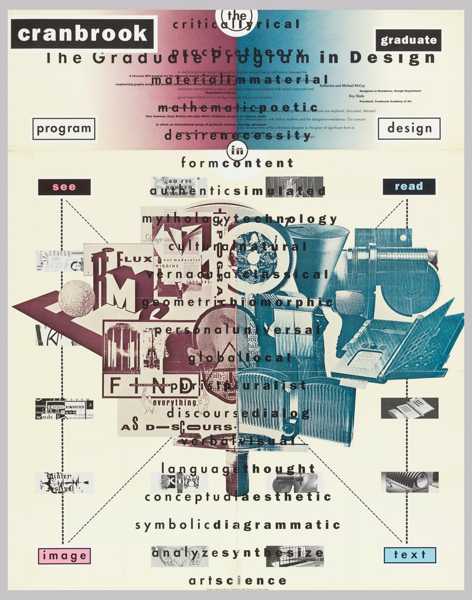

# Deconstructionism

## 1. Definition

Deconstructionism is a postmodern design approach that became influential during the 1980s and 1990s. It challenges traditional ideas of order and structure by creating designs that appear fragmented, layered, distorted, or intentionally disorganized.

## 2. Characteristics

- Fragmented and broken layouts
- Layered text and images
- Distorted or experimental typography
- Asymmetrical compositions
- Unusual spacing and alignment
- Rejection of traditional design rules

## 3. Imagery

Deconstructionist designs often include overlapping text, fragmented images, unusual typography, and layouts that appear intentionally chaotic or unfinished.

### Image Description

## 4. Color Scheme

Deconstructionism does not have one specific color scheme. Designers may use black and white, neutral colors, or bold contrasting colors depending on the message and visual effect they want to create.

## 5. Examples

- David Carson's experimental graphic design
- Ray Gun magazine layouts
- Experimental posters using fragmented typography and overlapping images

## 6. References

Cooper Hewitt, Smithsonian Design Museum. “Deconstructivist Graphic Design.”
