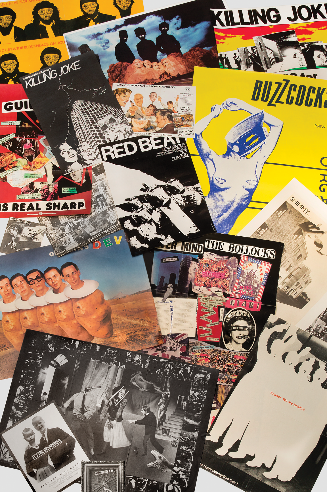

# Punk Design

## 1. Definition

Punk Design is a postmodern graphic design style that developed alongside the punk music movement during the 1970s. It rejected polished and traditional design by using rough, handmade, and rebellious visuals.

## 2. Characteristics

- Rough and handmade appearance
- Ripped or cut-and-paste typography
- Collage techniques
- Distorted photographs
- Uneven and chaotic layouts
- DIY and rebellious style

## 3. Imagery

Punk Design often uses torn paper, photocopied photographs, handwritten text, newspaper clippings, and collage. Designs intentionally look rough and imperfect instead of professionally polished.

### Image Description

## 4. Color Scheme
Punk Design commonly uses black and white with strong contrasting colors such as red, pink, or yellow. High contrast helps create the aggressive and attention-grabbing appearance associated with punk culture.

## 5. Examples

- Jamie Reid's designs for the Sex Pistols
- Punk concert posters and flyers
- Punk music album and magazine designs

## 6. References
Cranbrook Art Museum. “Too Fast to Live, Too Young to Die: Punk Graphics, 1976–1986.” Cranbrook Art Museum, 31 May 2018. https://cranbrookartmuseum.org/2018/05/31/too-fast-to-live-too-young-to-die-punk-graphics-1976-1986-opens-at-cranbrook-art-museum-dezeen/
